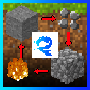

# RP-StoneCobbler   
📄 [Click here for the English README](./README-EN.md)  
---
   

**石をストーンカッターで砕いて「石礫（Pebble）」に！**  
さらに、4つの石礫をクラフトすれば「丸石（Cobblestone）」に戻せる、  
サバイバル補助向けのシンプルなFabric MODです。

---

## 🧱 概要

- `Stone` を **ストーンカッター** で `Pebble` に変換  
- `Pebble` を **2×2クラフト** で `Cobblestone` に変換（手持ちでもOK）

---

## 🛠 対応環境

- **Minecraft**：1.21.4
- **Fabric Loader**：0.16.10 以上
- **Java**：21 以上

---

## 📦 ダウンロード

[🔗 最新リリースはこちら](https://github.com/Ruprous/RP-StoneCobbler/releases)

- `stonecobbler-1.0.0.jar` → プレイヤー向けMOD本体
- `stonecobbler-1.0.0-sources.jar` → ソースコード（開発者向け）

---

## 📝 ライセンス

MIT License  
© 2025 [Ruprous](https://x.com/ruprous)
